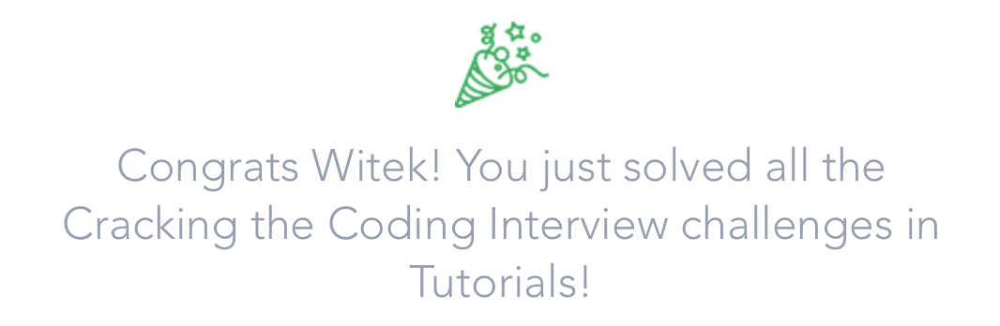

    

# Cracking the Coding Interview

>Ace your next interview by solving these code challenges, which cover important concepts for any coding interview.

### Cracking the Coding Interview Challenges

##### Data Structures
- [x] [Arrays: Left Rotation](Data%Structures/arrays-left-rotation.swift) `Easy`
- [x] [Strings: Making Anagrams](Data%Structures/stacks-balanced-brackets.swift) `Easy`
- [x] [Hash Tables: Ransom Note](Data%Structures/hash-tables-ransom-note.swift) `Easy`
- [x] [Linked Lists: Detect a Cycle](Data%Structures/linked-lists-detect-a-cycle.swift) `Easy`
- [x] [Stacks: Balanced Brackets](Data%Structures/stacks-balanced-brackets.swift) `Medium`
- [x] [Queues: A Tale of Two Stacks](Data%Structures/queues-a-tale-of-two-stacks.swift) `Medium`
- [x] [Trees: Is This a Binary Search Tree?](Data%Structures/trees-is-this-a-binary-search-tree.swift) `Medium`
- [x] [Heaps: Find the Running Median](Data%Structures/heaps-find-the-running-median.swift) `Hard`
- [x] [Tries: Contacts](Data%Structures/tries-contacts.swift) `Hard`

##### Algorithms
- [x] [Sorting: Bubble Sort](Algorithms/sorting-bubble-sort.swift) `Medium`
- [x] [Sorting: Comparator](Algorithms/sorting-comparator.swift) `Medium`
- [x] [Merge Sort: Counting Inversions](Algorithms/merge-sort-counting-inversions.swift) `Hard`
- [x] [Binary Search: Ice Cream Parlor](Algorithms/binary-search-ice-cream-parlol.swift) `Medium`
- [x] [DFS: Connected Cell in a Grid](Algorithms/dfs-connected-cell-in-a-grid.swift) `Hard`
- [x] [BFS: Shortest Reach in a Graph](Algorithms/bfs-shortest-reach-in-a-graph.swift) `Hard`

##### Techniques/Concepts
- [x] [Time Complexity: Primality](Techniques-Concepts/time-complexity-primality.swift) `Medium`
- [x] [Recursion: Fibonacci Numbers](Techniques-Concepts/recursion-fibonacci-numbers.swift) `Easy`
- [x] [Recursion: Davis' Staircase](Techniques-Concepts/recursion-davis-staircase.swift) `Medium`
- [x] [DP: Coin Change](Techniques-Concepts/dp-coin-change.swift) `Hard`
- [x] [Bit Manipulation: Lonely Integer](Techniques-Concepts/bit-manipulation-lonely-integer.swift) `Easy`
